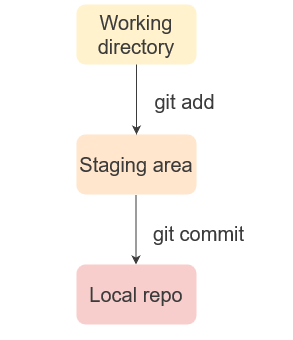

# Getting Started with Git
> What is Git?
> [Git](https://git-scm.com/) is a widely used Version Control System (VCS) that lets you keep track of all the modifications you make to your code. [Git tutorial](https://courses.analyticsvidhya.com/courses/take/getting-started-with-git-and-github-for-data-science-professionals/texts/13970806-what-is-git)

## Table of contents
* [General info](#general-info)
* [Diagram Github](#diagram-github)
* [Understand Git Terminology](#understand-git-terminology)
* [Setup](#setup)
* [Configure Git](#configure-git)
* [Committing files in Git](#committing-files-in-git)
* [View Logs in Git](#view-logs-in-git)
* [Create Remote Repository](#create-remote-repository)
* [Status](#status)
* [Inspiration](#inspiration)
* [Contact](#contact)

## General info
This is a beginer github tutorial from [Analytics Vidhya](https://www.analyticsvidhya.com/) and [Git url](https://git-scm.com/)
There are a lot great tutorial, but here is an inicial for beginer.  

## Diagram Github 
  

## Understand Git Terminology   
* What is a Repository?   
**Resository** or **Repo** is a folder that contains all the project files and the history of the revisions made to each file.   There are two repositories: Remote repo and Local repo:     
> **Remote repo** contains your project that can be accessed from anywhere and by anyone.    
> **Local repo** is a copy of the remote repo that resides on your local machine.   

* Understand Cloning:   
> **git clone "Repo-URL"**  
> **Cloning** means creating copy of the remote **repo** on your local machine.   

* Let's Commit!:   
> **git commit -m "commit messages"**  
> When you **commit** a change, you save the changes you made to your files in the repo. When working with Git from your local machine, using the commit command will save your files in the local repo. To make those changes in the remote repo, you will use **push** command.  

* Understanding Push:  
> **git push origin "branch"**  
> **Push** command allows you to transfer all the changes on your local repo to the remote repo.  

* Understanding Pull:  
> **git pull "remote-repo"**  
> If push meant transferring code to the remote repo, the **Pull** command allows you to transfer all the changes from the remote repo to your local repo.
> There are a few more terms that you will to know but they are not required right now. For now, let's create our very first GitHub repository!  

## Setup
* Install Git in your system (ubuntu):   

The first thing you shoud do is download Git on your system.  
Download Git for your Operating System from [here](https://git-scm.com/downloads)  
Now, Git programs are designed to work with a Unix style command-line environment.    

**Debian/Ubuntu**   
For the latest stable version for your release of Debian/Ubuntu   

**`$sudo apt-get install git`**   

We will be using the command line for linux users and macOS.   
The next thing you have to do is create a project folder where you will save your local repository.  

* Let's Initialize Git !   

Repository or repo is a folder that contains al the project files and the revision made to each file.  
For adtional options see [git init](https://git-scm.com/docs/git-init)  

**`$git init`**  
Initialized empty Git repository  

   

This command create in the current working directory a hidden file ".git"  
This is your local Git repo.
 

## Configure Git
Before we make any changes to our repo, we want Git to know who we are. Using the [git config](https://git-scm.com/docs/git-config) command.  We can set the user name and user email address. This is saved by Git so that you know who made that change every time we make a commint.

**`$git config --global user.name "user-name"`**  
**`$git config --global user.mail "user-email"`**    

Git with **--global** option save this information for all the repositories in the system. You can leave it out if you only want the information to be saved for this particular repo.

## Committing files in Git
Now you can start building your project and adding files to your project directory that it is empty right now.  
Once you have created and added files toyour project directory, you can add them to your local Git repo using.  

**`$git add "file-name"`**

If you want to add more than one file at a time, use.

**`$git add . `**

We haven't added the files to the local repo yet. We have just told Git that some changes were made and we want save these changes in the next **commit/save**.  As of now, these added files are in a place called the **Staging area**.

> * **Staging area** is an intermediate place between your working directory and local repo where any changes that you made can be reviewed before you actually commit them to the repo*.   

   

You can check the state of the staging area using:

**`$git status`**

  

You will see a messages similar to the one shown above which tells you that a change was made that needs to be committed.  All the pending commits will be shown here.  

Now you can take a snapshot of all the changes you made, which are reflected in the staging area, and save them in the Git repousing:  

**`$git commit -m "Commit messages"`**  

Your commit message should be terse but lucid so that fellow developers can easily determine why you made that change.  

When you do that you will get the following message:

   

Now all your files have been committed to the Git repo.  You can check the status of the staging area and this time it will reflect that is nothing to commit.  

**`$git status`**  

We are going to make a few changes to pair of files and commit it after the changes are made:  

As we can see, when we added th files again, Git was smart enough to know that we have only made changes to a pair fo files. The commit that we made after this only update that specific file and not the others.  

## View Logs in Git
The whole point of version control is to keep a record of the changes that were made. Yo can do this using:

**`$git log`**   

   

As you can see, my name, email address, timestamp, and the commit messages are reflected in the logs. This makes it fairly easy to track who made what changes and determine when the bug was first introduced in the project.   

## Create Remote Repository
So far we were working on local repository, meaning all the changes that were made were tracked in your local machine and our fellow developers were not able to see them yet. To make that happen, we need to create a renote repository that can be accessed from anywhere and by anyone. This is were GitHub comes in!
So let's create a remote repository!

*Note: You would need to create a GitHub account for this*.

#### Step to create a remote repositiory

1. In the upper right-hand corner, click the + sign and click **New Repository**. 
  

2. On the next page, give a name to your repository and a short description. Once you are done,click **Create repositiory**.
   

#### Add git remote to your repository

Once you have created your Github repository, Github will prompt you to upload your files to the remote repo.
  

As we have already created our local repository, we first need to sync our local and remote repos.  
We can do this using **git remote add origin "URL"**  
   

+ The command creates a connection between the local and remote repos.  
+ Once we do that, we no longer have to refer to the remote repo by the URL every time.  
+ We can just use the name **origin** to refer to the remote repo. 

#### Push using Git

Now that the remote repo has been added, all you have to do is **push** your commits from local repo to the remote repo so that all your fellow developers can view the changes.  

You transfer the local repo to the remote repo on GitHub server using **git push -u origin "branch-name"**   

   

*note: origin is the name of our remote repo*  

## Inspiration
Add here credits. Project inspired by..., based on...

## Contact
Created by [@InovasSpA](mario.aviles@arssp.cl) - feel free to contact me! 
